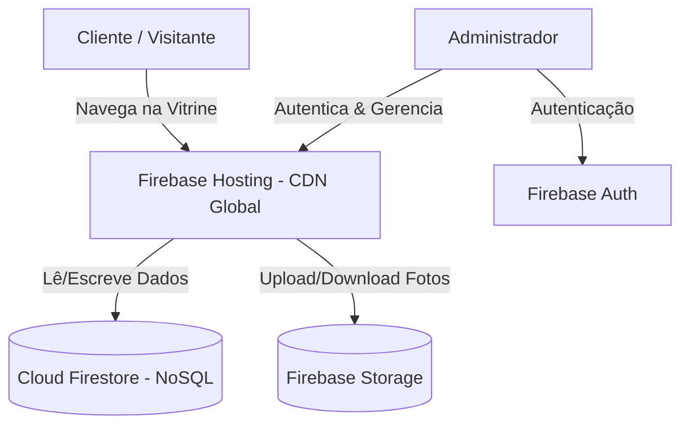

# 🛍️ Bazar da Mudança (Brasil → Polônia)

Aplicação web desenvolvida para a gestão e exibição de itens à venda no bazar da mudança de família (Brasil para Polônia). O sistema conta com vitrine pública para visitantes, detalhes dos produtos, status em tempo real (Disponível, Reservado, Vendido) e um painel administrativo protegido para cadastro, edição e remoção de itens.

---

## 🏗️ Arquitetura e Tecnologias

A aplicação segue uma arquitetura **Jamstack** moderna, combinando renderização estática rápida no front-end com serviços serverless no back-end.



### 💻 Front-End
- **[Next.js 16 (App Router)](https://nextjs.org/)**: Framework React configurado para exportação estática (`output: 'export'`), gerando arquivos HTML/JS/CSS otimizados.
- **[React 19](https://react.dev/) & [TypeScript](https://www.typescriptlang.org/)**: Construção da interface em componentes com tipagem estática e reatividade.
- **[Tailwind CSS v4](https://tailwindcss.com/)**: Estilização moderna com utilitários e variáveis CSS integradas.
- **[Lucide React](https://lucide.dev/)**: Coleção de ícones vetoriais leves.

### ☁️ Back-End & Infraestrutura (Firebase)
- **[Firebase Hosting](https://firebase.google.com/docs/hosting)**: Hospedagem e distribuição global estática da pasta `out/` via CDN.
- **[Cloud Firestore](https://firebase.google.com/docs/firestore)**: Banco de dados NoSQL em tempo real para sincronização e armazenamento do catálogo de itens.
- **[Firebase Storage](https://firebase.google.com/docs/storage)**: Armazenamento seguro das imagens dos produtos.
- **[Firebase Authentication](https://firebase.google.com/docs/auth)**: Autenticação de administradores para controle de acesso ao painel interno.

---

## 📁 Estrutura de Pastas

```text
BazarApp/
├── public/                 # Arquivos estáticos (favicon, imagem OpenGraph)
├── src/
│   ├── app/                # Rotas da aplicação (App Router)
│   │   ├── admin/          # Painel administrativo de gerenciamento de itens
│   │   ├── item/[id]/      # Página de detalhes de um item específico
│   │   ├── login/          # Autenticação de administradores
│   │   ├── layout.tsx      # Layout raiz com cabeçalho, rodapé e metadados SEO/OG
│   │   └── page.tsx        # Vitrine principal do bazar
│   ├── components/         # Componentes reutilizáveis de interface (Header, Footer, etc.)
│   ├── lib/                # Configurações de serviços (firebase.ts, useAuth.ts)
│   └── services/           # Regras de negócio e integração Firestore/Storage (items.ts)
├── firebase.json           # Configuração de hospedagem do Firebase CLI
├── .firebaserc             # Mapeamento do projeto Firebase (`bazardoskaras`)
└── next.config.ts          # Configuração do Next.js (exportação estática)
```

---

## ⚙️ Configuração Local

### 1. Pré-requisitos
- **Node.js** (v18.x ou superior)
- **npm**, **yarn** ou **pnpm**

### 2. Instalação de Dependências
```bash
npm install
```

### 3. Variáveis de Ambiente
Crie um arquivo `.env.local` na raiz do projeto com as credenciais do seu projeto Firebase:

```env
NEXT_PUBLIC_FIREBASE_API_KEY=seu_api_key
NEXT_PUBLIC_FIREBASE_AUTH_DOMAIN=seu_projeto.firebaseapp.com
NEXT_PUBLIC_FIREBASE_PROJECT_ID=seu_project_id
NEXT_PUBLIC_FIREBASE_STORAGE_BUCKET=seu_projeto.firebasestorage.app
NEXT_PUBLIC_FIREBASE_MESSAGING_SENDER_ID=seu_messaging_sender_id
NEXT_PUBLIC_FIREBASE_APP_ID=seu_app_id
```

### 4. Executar em Desenvolvimento
```bash
npm run dev
```
Acesse `http://localhost:3000` no seu navegador.

---

## 🚀 Processo de Deploy em Produção

O deploy é realizado estaticamente no **Firebase Hosting**.

### Passo 1: Gerar o Build Estático
Execute o comando de build para compilar a aplicação Next.js e gerar a pasta `out/`:

```bash
npm run build
```

### Passo 2: Autenticar no Firebase CLI (Caso necessário)
Se ainda não estiver autenticado no Firebase CLI no seu ambiente local, faça o login:

```bash
npx firebase login
```

### Passo 3: Fazer o Deploy para o Hosting
Execute o comando de deploy informando a flag do Hosting:

```bash
npx firebase deploy --only hosting
```

Após a conclusão, a CLI do Firebase exibirá a URL de produção pública (ex: `https://bazardoskaras.web.app`).

---

## 🔒 Regras de Segurança Recomendadas (Firebase Console)

Para garantir a integridade dos dados em produção, certifique-se de configurar as regras de segurança no Firebase Console:

### Cloud Firestore Rules
- **Leitura pública** para itens (`allow read: if true;`).
- **Escrita restrita** apenas para usuários autenticados (`allow write: if request.auth != null;`).

### Firebase Storage Rules
- **Leitura pública** das fotos (`allow read: if true;`).
- **Upload/Exclusão restrita** a administradores autenticados (`allow write: if request.auth != null;`).
