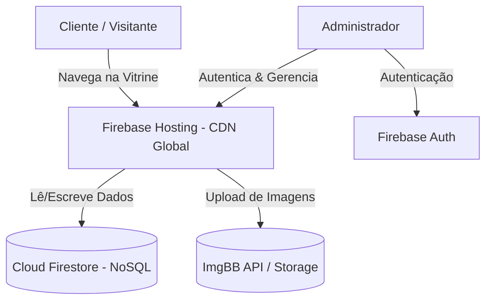

# 🛍️ Bazar da Mudança (Brasil → Polônia)

Aplicação web moderna desenvolvida para a gestão e exibição de itens à venda no bazar da mudança de família. O sistema conta com uma vitrine pública para visitantes com busca/filtro por categorias, botão inteligente de compartilhamento nas redes sociais (WhatsApp, Facebook, Instagram), detalhes do produto com contador de interessados em tempo real e um painel administrativo protegido para cadastro, edição e controle de métricas financeiras.

---

## 🏗️ Arquitetura e Tecnologias

A aplicação segue uma arquitetura **Jamstack** moderna, combinando renderização estática ultra-rápida no front-end com serviços serverless no back-end.



### 💻 Front-End
- **[Next.js 16 (App Router)](https://nextjs.org/)**: Framework React com suporte a exportação estática (`output: 'export'`), gerando arquivos HTML/JS/CSS totalmente otimizados para CDN.
- **[React 19](https://react.dev/) & [TypeScript](https://www.typescriptlang.org/)**: Interface reativa, modular e fortemente tipada.
- **[Tailwind CSS v4](https://tailwindcss.com/)**: Estilização moderna e responsiva com utilitários otimizados.
- **[Lucide React](https://lucide.dev/)**: Coleção de ícones vetoriais leves e consistentes.

### ☁️ Back-End & Infraestrutura
- **[Firebase Hosting](https://firebase.google.com/docs/hosting)**: Hospedagem global de alta performance para a aplicação estática via CDN.
- **[Cloud Firestore](https://firebase.google.com/docs/firestore)**: Banco de dados NoSQL em tempo real para sincronização do catálogo de itens, reservas e métricas.
- **[Firebase Authentication](https://firebase.google.com/docs/auth)**: Autenticação de administradores para controle de acesso ao painel de gestão.
- **[ImgBB API](https://imgbb.com/)**: Armazenamento rápido de imagens dos produtos via API com suporte a URLs diretas.

---

## 📁 Estrutura de Pastas

```text
BazarApp/
├── public/                 # Arquivos estáticos (favicon, ícone OpenGraph)
├── src/
│   ├── app/                # Rotas da aplicação (App Router)
│   │   ├── admin/          # Painel administrativo de gestão e métricas
│   │   │   ├── edit/       # Edição de itens existentes
│   │   │   └── new/        # Cadastro de novos itens com categorias
│   │   ├── item/           # Página de detalhes do item e reservas
│   │   ├── login/          # Autenticação de administradores
│   │   ├── layout.tsx      # Layout raiz com cabeçalho, rodapé e SEO
│   │   └── page.tsx        # Vitrine principal com filtro de categorias
│   ├── components/         # Componentes reutilizáveis (Header, Footer, ShareModal)
│   ├── lib/                # Configurações do Firebase e hooks (firebase.ts, useAuth.ts)
│   └── services/           # Regras de negócio e integração Firestore (items.ts)
├── firebase.json           # Configuração de hospedagem do Firebase CLI
├── .firebaserc             # Mapeamento do projeto Firebase (`bazardoskaras`)
└── next.config.ts          # Configuração do Next.js (exportação estática)
```

---

## ⚙️ Configuração Local

### 1. Pré-requisitos
- **Node.js** (v18.x ou superior)
- **npm**, **yarn** ou **pnpm**

### 2. Instalação de Dependências
```bash
npm install
```

### 3. Variáveis de Ambiente
Crie um arquivo `.env.local` na raiz do projeto contendo as credenciais do seu projeto Firebase e da API do ImgBB:

```env
NEXT_PUBLIC_FIREBASE_API_KEY=seu_api_key
NEXT_PUBLIC_FIREBASE_AUTH_DOMAIN=seu_projeto.firebaseapp.com
NEXT_PUBLIC_FIREBASE_PROJECT_ID=seu_project_id
NEXT_PUBLIC_FIREBASE_STORAGE_BUCKET=seu_projeto.firebasestorage.app
NEXT_PUBLIC_FIREBASE_MESSAGING_SENDER_ID=seu_messaging_sender_id
NEXT_PUBLIC_FIREBASE_APP_ID=seu_app_id
NEXT_PUBLIC_IMGBB_API_KEY=sua_chave_imgbb
```

### 4. Executar em Desenvolvimento
```bash
npm run dev
```
Acesse `http://localhost:3000` no seu navegador.

---

## 🚀 Processo de Deploy em Produção

O deploy é realizado de forma estática no **Firebase Hosting**.

### Passo 1: Gerar a Build Estática
Compila a aplicação e gera os artefatos prontos na pasta `out/`:

```bash
npm run build
```

### Passo 2: Autenticar no Firebase CLI (Caso necessário)
Se for a primeira vez configurando o ambiente:

```bash
npx firebase login
```

### Passo 3: Fazer o Deploy para o Hosting
Execute o comando de publicação do Hosting:

```bash
npx firebase deploy --only hosting
```

A CLI fornecerá a URL pública do seu bazar (ex: `https://bazardoskaras.web.app`).

---

## 🤝 Contribuições & Melhorias

Melhorias e novas ideias são **muito bem-vindas**! Se você deseja propor uma melhoria, nova funcionalidade ou correção de bug:

1. Faça um **Fork** deste repositório.
2. Crie uma branch para a sua alteração (`git checkout -b feature/minha-melhoria`).
3. Faça os commits com suas mudanças.
4. Abra um **Pull Request (PR)** detalhando as alterações propostas.

> 🛡️ **Nota sobre colaboração**: Todos os Pull Requests serão revisados antes do merge para garantir uma colaboração segura, código de qualidade e em conformidade com a proposta do **Nosso Bazar**.

---

## 📄 Licença Open Source (MIT License)

Este projeto é de código aberto e está licenciado sob a **[Licença MIT](https://opensource.org/licenses/MIT)**. 

Você é livre para usar, copiar, modificar, mesclar, publicar, distribuir e criar seu próprio sistema de bazar de forma **100% gratuita** e ilimitada para suas próprias necessidades.

```text
MIT License

Copyright (c) 2026 Alison Karas & Colaboradores

Permission is hereby granted, free of charge, to any person obtaining a copy
of this software and associated documentation files (the "Software"), to deal
in the Software without restriction, including without limitation the rights
to use, copy, modify, merge, publish, distribute, sublicense, and/or sell
copies of the Software, and to permit persons to whom the Software is
furnished to do so, subject to the following conditions:

The above copyright notice and this permission notice shall be included in all
copies or substantial portions of the Software.

THE SOFTWARE IS PROVIDED "AS IS", WITHOUT WARRANTY OF ANY KIND, EXPRESS OR
IMPLIED, INCLUDING BUT NOT LIMITED TO THE WARRANTIES OF MERCHANTABILITY,
FITNESS FOR A PARTICULAR PURPOSE AND NONINFRINGEMENT. IN NO EVENT SHALL THE
AUTHORS OR COPYRIGHT HOLDERS BE LIABLE FOR ANY CLAIM, DAMAGES OR OTHER
LIABILITY, WHETHER IN AN ACTION OF CONTRACT, TORT OR OTHERWISE, ARISING FROM,
OUT OF OR IN CONNECTION WITH THE SOFTWARE OR THE USE OR OTHER DEALINGS IN THE
SOFTWARE.
```
